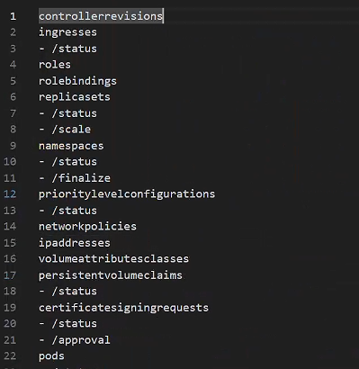
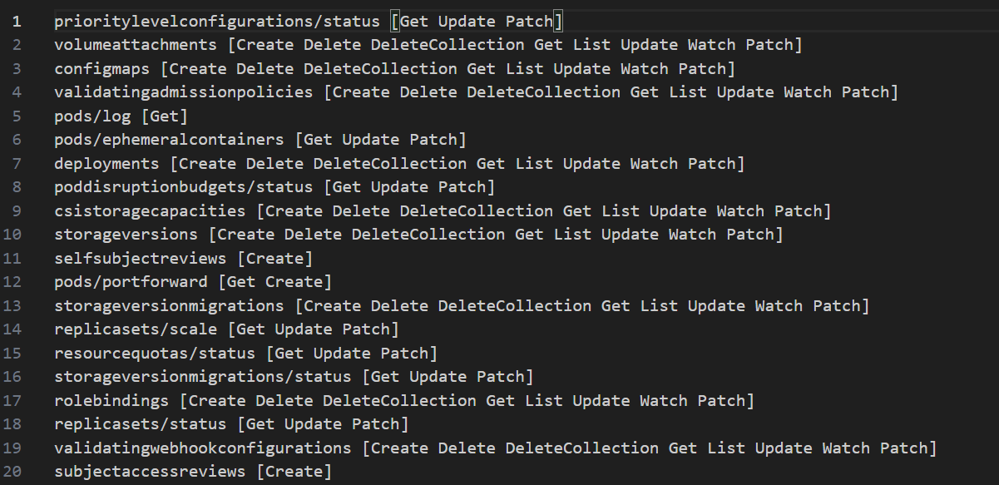

This is a anonymous repository for my USENIX Security 2025 submit.

# Step to run the static analysis tool

For the two tools mentioned in the paper, the steps to run them are as follows:

## Step1

Download the k8s source code to the local machine (assuming that the Windows operating system is used, and the save path is the root directory of the D drive).

## Step2
### Resource Identification
For the Resource Identification section, run the run.bat script in the ResourceIdentification directory to launch static analysis. 

This static analysis tool, based on the unified characteristics during the registration of Kubernetes resources, achieves automated collection of all resources within Kubernetes. The result will yield a list of all primary and secondary resources in Kubernetes.

The results will be output to the files: registry.txt and vendor.txt(The sum of the contents of these two files will be the final analysis result.).
Below is an example of the running results. 

### Explicit Permission Analysis
For the Explicit Permission Analysis section, execute the run.bat script in the ExplicitPermissionAnalysis directory to launch static analysis.

This static analysis tool, based on the method definitions of storage objects corresponding to resources in Kubernetes, achieves automated collection of explicit permissions associated with all resources in Kubernetes. The outcome will provide a list of explicit permissions corresponding to resources (including primary and secondary resources) in Kubernetes.

The results will be output to the files: registry.txt and vendor.txt(The sum of the contents of these two files will be the final analysis result).
Below is an example of the running results. 
